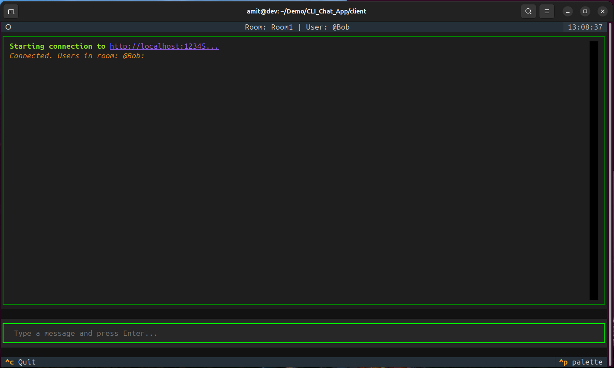

# CLI Chat App

A modern, highly-scalable, End-to-End Encrypted (E2EE) command-line chat application. It allows users to communicate in real-time within specific rooms using a Terminal User Interface (TUI), ensuring that the server routing the messages cannot read the plaintext content.



---

## Architecture Overview

The application is built on a client-server architecture using WebSockets (`Socket.IO`) for low-latency, real-time communication.

### 1. The Server (`Node.js`)
The backend is a lightweight, stateless Node.js server running `Socket.IO`. 
* **Role:** It acts purely as a message router and presence tracker. It manages who is in which room and broadcasts encrypted byte payloads between them.
* **Security:** The server **never** sees plaintext messages. It only routes Base64 strings.
* **Public Key Caching:** When a user joins and broadcast their RSA Public Key, the server temporarily caches it. If a late-joiner connects to the room, the server instantly sends them the cached keys so they can encrypt messages immediately without requiring an expensive "key broadcast storm."
* **Heartbeats:** The server runs a background routine to detect and automatically kick disconnected or inactive users (2-minute timeout).

### 2. The Client (`Python Textual`)
The frontend is a Python CLI that relies on the `Textual` framework for a rich, async terminal UI, and `cryptography` for the E2EE security.
* **Role:** It handles user input, rendering the UI, maintaining the local key ring (storing peer public keys), and performing all the heavy encryption math.
* **Hybrid E2EE Encryption Protocol:**
  Whenever a message is sent (either to the room or a DM), the client performs Hybrid Encryption to bypass the strict payload-size limits of pure RSA:
  1. A random, temporary **AES-256** key is generated.
  2. The large text message is encrypted *once* using this fast AES key.
  3. The tiny AES key is then encrypted using the recipient's **RSA** Public Key. (If sending to a room of 10 people, the AES key is RSA-encrypted 10 separate times, once for each peer's public key).
  4. The client packages the AES payload and the list of RSA-wrapped keys and sends it to the server for distribution.

---

## Constraints & Limitations

* **No Message History:** Because the server cannot decrypt messages, it cannot store a readable chat history. Once you close your client, past messages are gone from the UI (though they are saved locally to your `log_<username>.txt` file).
* **Trust on First Use (TOFU):** Public keys are exchanged blindly when joining a room. There is currently no out-of-band verification (like scanning a QR code or comparing fingerprints) to prevent Man-In-The-Middle (MITM) attacks if the server itself is compromised by a malicious actor.
* **Device Portability:** Your RSA Private Key is generated randomly in RAM every time you run the client. If you log out and log back in, you are considered a "new" identity from a cryptographic perspective.

---

## Installation & Setup

### Prerequisites
* **Server:** Node.js (v18+) and `npm`.
* **Client:** Python (3.12+), `pip`, and `venv`.

### Running the Server
1. Navigate to the server directory:
   ```bash
   cd server
   ```
2. Install the necessary dependencies:
   ```bash
   npm install
   ```
3. Start the server (runs on `http://0.0.0.0:12345` by default):
   ```bash
   npm start
   ```
*(The server features structured logging via Winston, tracking room creation, key exchanges, and message deliveries in `server.log` and the terminal).*

Alternatively, a public cloud instance is live and continuously running at:
`https://cli-chat-app-hea4.onrender.com`

### Running the CLI Client
Because modern Linux distributions enforce PEP-668 (externally managed environments), you must run the client inside a virtual environment.

1. Navigate to the client directory:
   ```bash
   cd client
   ```
2. Create and activate a Virtual Environment (if not already done):
   ```bash
   python3 -m venv venv
   source venv/bin/activate
   ```
3. Install the dependencies:
   ```bash
   pip install cryptography textual python-socketio[client] aiohttp requests
   ```
4. Run the Client:
   ```bash
   python3 cli_client.py <room_name> <your_username> [server_url]
   ```
   **Example (Connecting to the Live Cloud Backend):**
   ```bash
   python3 cli_client.py Room1 Alice https://cli-chat-app-hea4.onrender.com
   ```
   
   **Example (Connecting to a Local Server):**
   ```bash
   python3 cli_client.py Room1 Alice http://localhost:12345
   ```

---

## Using the CLI Client

Once connected to the server, the Textual UI will load.

* **Sending a Message to the Room:**
  Simply type your message in the bottom input bar and press `Enter`. The message will be hybrid-encrypted for everyone currently listed in the room.
  
* **Sending a Private Message (DM):**
  You can send a securely encrypted private message to a specific user inside the room. They are the *only* person who will receive the payload from the server.
  Use the `/DM` command (case-insensitive username matching):
  ```text
  /DM @Bob message content here
  ```
  *(e.g., `/dm bob hey Bob!`)

* **Exiting:**
  To gracefully leave the room and close the UI, type `exit()` in the input bar and press Enter, or use the `Ctrl+C` keyboard shortcut.
